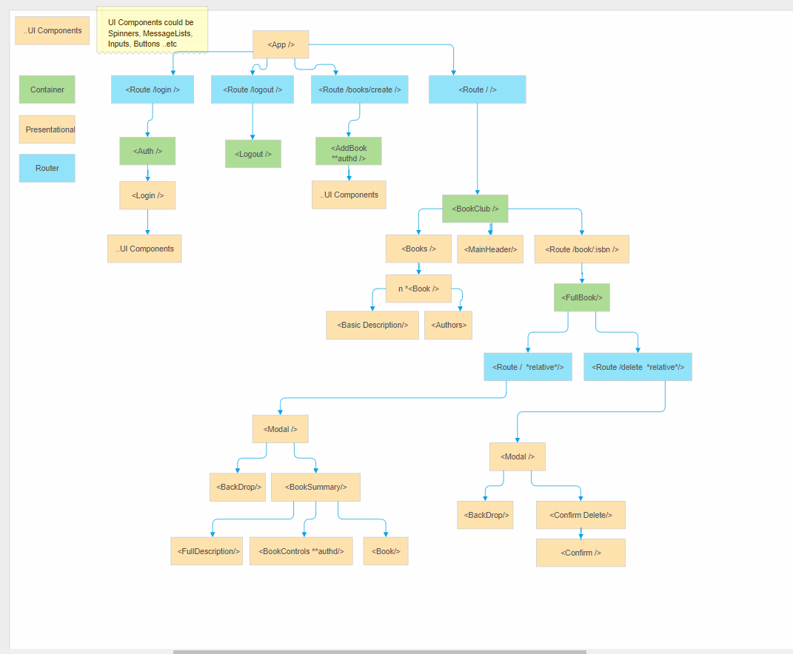

# Client Side
> contents
- app structure
- considerations when developing

## App Structure

The app tree is as follows.
*UI* Components not included in tree as there are too many!

## considerations when developing

React router was leveraged to make the app feel as restful as possible. You will noticed nested routes at logical points for viewing/acting upon a particular resource.

The redux store holds **two** main reducers, Auth and BookClub.
Axios is used as the AJAX library as it allows easy creation of global settings.
