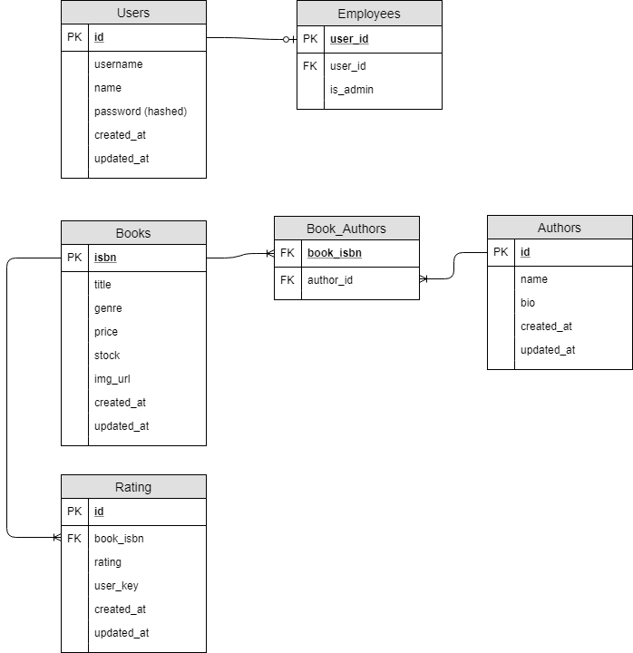

# Server and Database Design

> contents
- Tech Used
- ERD (database design)
- Server

## Tech Used
The backend of this application is a **Node Express** application using **Sequelize** as a database ORM with **MySQL** as the database.
Image storing is done via **Cloudinary** Image hosting service. All remote img URLS are stored by this service to avoid issues where remote URL break. The server side captures the MVC pattern with the exception of controllers imparting changes on views (which is taken care of by the React client)

 ## ERD
Based on the given requirements provided by the sprint planning and story:
- A user should be able to view a list of books
- A user should be able to rank/filter/sort/paginate books
- An employee should be able to perform CRUD on books

Below is the ERD for the database in it's current state. Given that the sprint planning didn't require the immediate implementation of many the initial features (filtering/sorting), I still chose to take them into consideration with this design to improve scalability. *Filter and sorting could generally be done by query parameters and carefully scripted SQL*

### Things to Note

#### User Employee Relationship

I anticipate that there may be the eventual requirement for the book clubs users to be able to register and perform more detail actions like provide reviews and manage them. For this reason I chose to implement the authorization schema like so. This application isn't currently at the state where it would require a full roles/permissions system (as the cost of implementation is not worth it at this time), however providing the 0-1 relation ship with **some** users being ***employees*** allows us to handle authorization in a easy and predictable way front end and back.

#### Book Authors Relationship

The Book authors many-to-many relationship allows for maximum flexibility when taking into account for edge cases where a book could have multiple authors (such is common in non-fiction books). At this point we are not leveraging this ability for a book to have many authors but now it is definitely possible!

#### Ratings

Although not implemented, the table has some key points that I would look to demonstrate.

There is a *user_key* field which for now is an anonymous key generated on the client to pass to the front end. We may have the opportunity to keep track of it via some local storage. This user_key is my anonymous fall back for the book clubs users not needing to register to provide a rating at this time. If we do implement registration, this allows us *the possibility* of finding and binding ratings to registered users at that time.

## Server

The server is an Express server. It has been designed to act as a lightweight JSON API. Authentication is done via JSON Web Tokens. The routes are seperated via middlewares that filter via valid/invalid jwts (for example)

Things to Note:
- the sequelize main instance belongs to /server/db/db.js as a js object. This allows for maximum convenience when wanting to interact with any Models or the sequelize object itself.
- the main server config can be found within /server/config/config it currently doesn't have a test configuration at this time.
